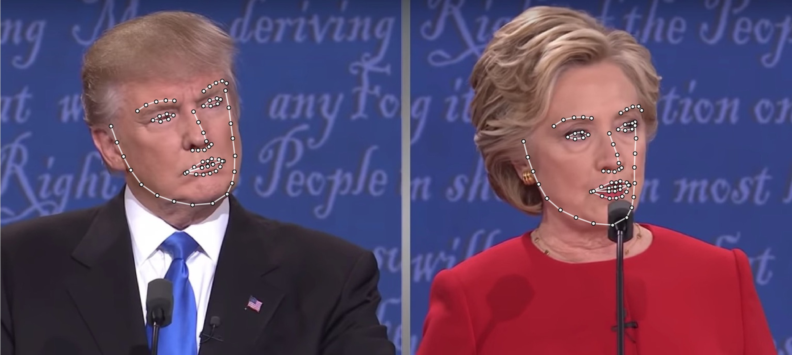
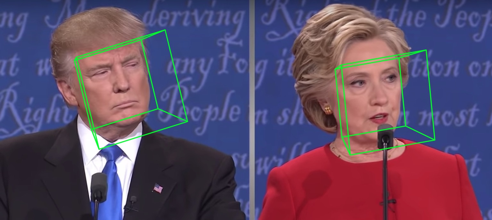
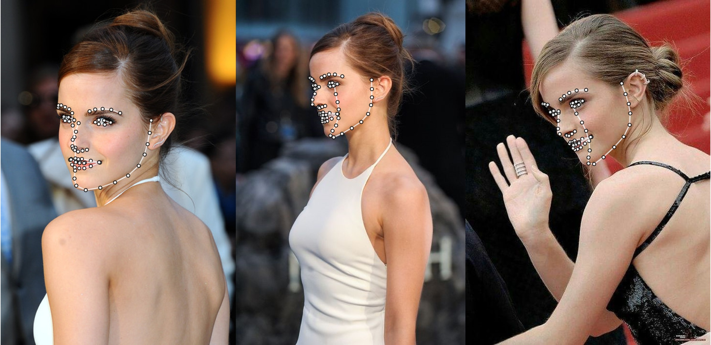
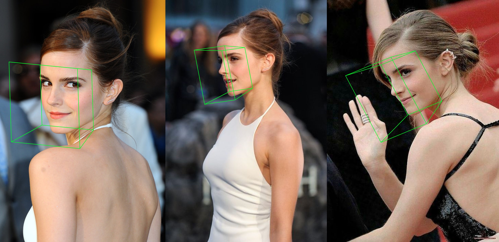

# Replay Attention and Data Augmentation Network for 3D Dense Alignment and Face Reconstruction
[](LICENSE)


## Introduction
This repo holds the pytorch improved re-implementation of paper [Replay Attention and Data Augmentation Network for 3D Dense Alignment and Face Reconstruction]. Several external works are added in this repo, including real-time training, training strategy and so on. Therefore, this repo is far more than re-implementation. One related blog will be published for some important technique details in future.
As far, this repo releases the pre-trained first-stage pytorch models of MobileNet-V1 structure, the pre-processed training&testing dataset and codebase.

## Getting started
### Requirements
 - PyTorch >= 0.4.1
 - Python >= 3.6 (Numpy, Scipy, Matplotlib)
 - Dlib (Dlib is optionally for face and landmarks detection. There is no need to use Dlib if you can provide face bouding bbox and landmarks. Besides, you can try the two-step inference strategy without initialized landmarks.)
 - OpenCV (Python version, for image IO opertations.)
 - Cython (For accelerating depth and PNCC render.)
 - Platform: Linux or macOS (Windows is not tested.)

 ```
 # installation structions
 sudo pip3 install torch torchvision # for cpu version. more option to see https://pytorch.org
 sudo pip3 install numpy scipy matplotlib
 sudo pip3 install dlib==19.5.0 # 19.15+ version may cause conflict with pytorch in Linux, this may take several minutes
 sudo pip3 install opencv-python
 sudo pip3 install cython
 ```

In addition, I strongly recommend using Python3.6+ instead of older version for its better design.

### Usage

1. Clone this repo (this may take some time as it is a little big)
    ```
    git clone https://github.com/zhouzhiyuan1/RADAN.git  # or git@github.com:zhouzhiyuan1/RADAN.git
    cd RADAN
    ```

2. Build cython module (just one line for building)
   ```
   cd utils/cython
   python3 setup.py build_ext -i
   ```
   This is for accelerating depth estimation and PNCC render since Python is too slow in for loop.
   
    
3. Run the `main.py` with arbitrary image as input
    ```
    python3 main.py -f samples/test1.jpg
    ```
    If you can see these output log in terminal, you run it successfully.
    ```
    Dump tp samples/test1_0.ply
    Save 68 3d landmarks to samples/test1_0.txt
    Dump obj with sampled texture to samples/test1_0.obj
    Dump tp samples/test1_1.ply
    Save 68 3d landmarks to samples/test1_1.txt
    Dump obj with sampled texture to samples/test1_1.obj
    Dump to samples/test1_pose.jpg
    Dump to samples/test1_depth.png
    Dump to samples/test1_pncc.png
    Save visualization result to samples/test1_3DDFA.jpg
    ```

    Because `test1.jpg` has two faces, there are two `.ply` and `.obj` files (can be rendered by Meshlab or Microsoft 3D Builder) predicted. Depth, PNCC, PAF and pose estimation are all set true by default. Please run `python3 main.py -h` or review the code for more details.

    The 68 landmarks visualization result `samples/test1_3DDFA.jpg` and pose estimation result `samples/test1_pose.jpg` are shown below:

<p align="center">
  
</p>

<p align="center">
  
</p>

4. Additional example

    ```
    python3 ./main.py -f samples/emma_input.jpg --bbox_init=two --dlib_bbox=false
    ```

<p align="center">
  
</p>

<p align="center">
  
</p>


## Evaluation
First, you should download the cropped testset ALFW and ALFW-2000-3D in [test.data.zip](https://pan.baidu.com/s/1DTVGCG5k0jjjhOc8GcSLOw), then unzip it and put it in the root directory.
Next, run the benchmark code by providing trained model path.
I have already provided five pre-trained models in `models` directory (seen in below table). These models are trained using different loss in the first stage. The model size is about 13M due to the high efficiency of MobileNet-V1 structure.
```
python3 ./benchmark.py -c models/phase1_wpdc_checkpoint_epoch_37.pth.tar
```


## Training
The training scripts lie in `training` directory. The related resources are in below table.

| Data | Download Link | Description |
|:-:|:-:|:-:|
| train.configs | [BaiduYun](https://pan.baidu.com/s/1ozZVs26-xE49sF7nystrKQ) or [Google Drive](https://drive.google.com/open?id=1dzwQNZNMppFVShLYoLEfU3EOj3tCeXOD), 217M | The directory contraining 3DMM params and filelists of training dataset |
| train_aug_120x120.zip | [BaiduYun](https://pan.baidu.com/s/19QNGst2E1pRKL7Dtx_L1MA) or [Google Drive](https://drive.google.com/open?id=17LfvBZFAeXt0ACPnVckfdrLTMHUpIQqE), 2.15G | The cropped images of augmentation training dataset |
| test.data.zip | [BaiduYun](https://pan.baidu.com/s/1DTVGCG5k0jjjhOc8GcSLOw) or [Google Drive](https://drive.google.com/file/d/1r_ciJ1M0BSRTwndIBt42GlPFRv6CvvEP/view?usp=sharing), 151M | The cropped images of AFLW and ALFW-2000-3D testset |

After preparing the training dataset and configuration files, go into `training` directory and run the bash scripts to train. 
The training configutations are all presented in bash scripts.

## FQA
1. Face bounding box initialization

    The original paper shows that using detected bounding box instead of ground truth box will cause a little performance drop. Thus the current face cropping method is robustest. Quantitative results are shown in below table.

<p align="center">
  
</p>

2. Face reconstruction
   
   The texture of non-visible area is distorted due to self-occlusion, therefore the non-visible face region may appear strange (a little horrible).


## Contact
**Jianzhu Guo (郭建珠)** [[Homepage](https://guojianzhu.com), [Google Scholar](https://scholar.google.com/citations?user=W8_JzNcAAAAJ&hl=en&oi=ao)]:  **jianzhu.guo@nlpr.ia.ac.cn**. 
